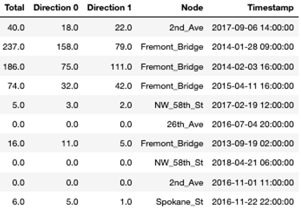
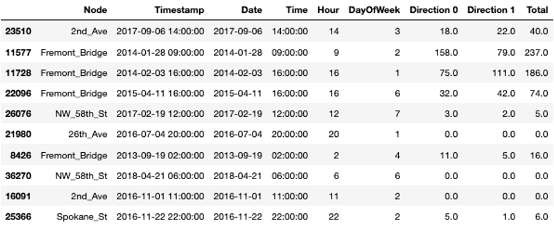
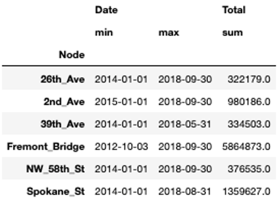
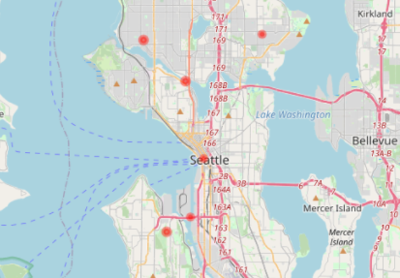

## Data Understanding and Preprocessing
 

<iframe src="https://player.vimeo.com/video/613344124?h=2f5296fec3&color=e700ef" width="640" height="360" frameborder="0" allow="autoplay; fullscreen; picture-in-picture" allowfullscreen></iframe>
 

 

Welcome to the second video of the tutorial for the AI Starter Kit on advanced visualisation. In this video, we will give an overview of the dataset that we will use in this Starter Kit.

The data we use is publicly-available data from the City of Seattle. The dataset contains information about bike rides at specific places in the city. At each spot, the number of bikes going in each direction per hour is counted.

In the table, you see a random sample of the data. The variable 'Node' refers to the single locations at which the bikes are counted, which is done in two directions. In a first step, we will add some additional variables to the table that will help us later on for the visualisations. From the timestamp column, we extract the date and time, respectively, the hour and the day of the week.

Additionally, we replace all possible missing measurements, hence where the variable 'Total' is not set, with zeros.

Now, we can extract some basic statistics from the data.

For all locations, we have data for at least three and a half years. For one of the locations,
Fremont Bridge, the data spans even over 6 years. We can also see that Spokane Street seems to be very popular with more than 1 million bike crossings in 4 and a half years while others only reach about 300.000 counts in the same time span.

Before we start with the advanced visualisations, let’s briefly check the location of the single nodes on the map. This allows us to verify whether they are close to important areas, like for example tourist or business areas, points-of-interest, etc. In our interactive Starter Kit, you can click on the red circles to see where the single nodes are located. Can you guess which marker is Spokane Street?

Spokane Street is on clear bottleneck in Seattle’s road network. It is one of the few points at which it is possible to cross from the city center to West Seattle, whereas people can choose many different roads in other areas of the city. Similarly, Fremont Bridge connects Queen Anne and Fremont which are also divided by a canal. In addition, NorthWest 58th Street, 39th Avenue and 26th Avenue are located furthest from the city center, which might explain why they see much less traffic.

With this first simple visualisation, we can already explain some characteristics of the data. In the next video, we will concentrate on the temporal evolution and seasonal patterns of the data at the different locations.
