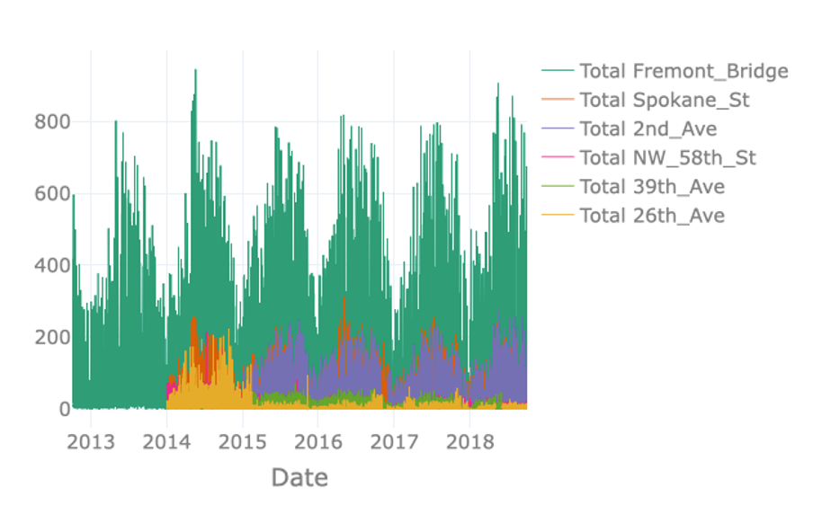
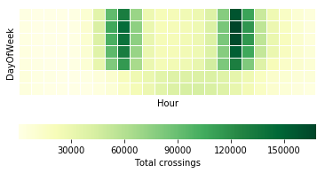

## Temporal and Seasonal Visualisations
 

<iframe src="https://player.vimeo.com/video/613346966?h=1514fc5af0&color=e700ef" width="640" height="360" frameborder="0" allow="autoplay; fullscreen; picture-in-picture" allowfullscreen></iframe>
 

 

Welcome to the third video of of the tutorial for the AI Starter Kit on advanced visualisation. In this video, we will concentrate on how to visualize time series data in the best way in order to underline seasonal effects. For this, we will introduce different kinds of visualisations and explain what are their strengths and weaknesses.

Since we are dealing with time series data, we can first use a timeline visualisation and plot the average number of crossings per hour and node over time. Such visualisations are on the one hand useful to observe abrupt changes in the data but on the other hand, also to identify time-sensitive trends, such as seasonal variation, increasing or decreasing trends, etc. Further, they make it easy to recognize periods with missing data.

The visualisation on the right just plots the total number of crossings per hour for each node. However, plotting the available data in this way results in a visualisation containing an excessive amount of information. Note for example that data of some nodes hides data of other nodes, a phenomenon called occlusion. The massive amount of information makes it difficult to identify interesting observations in the data such as possible seasonal patterns.

In order to resolve this issue, it is possible to resample the data to a lower frequency like for example daily or weekly crossings. In the interactive Starter Kit, this can easily be done by changing the resampling rate in the corresponding dropdown box.

The seasonal pattern is very clear when using monthly resampling, while it is not as clear when using daily and yearly resampling. For the former, the day-to-day variation makes it harder to see the average trend, while for the latter the seasonal patterns occur over a shorter time period than the time window we use for resampling.

Using a monthly resampling we can verify some of our former assumptions: first of all, Fremont Bridge clearly is the most popular node. A seasonal pattern is clearly visible for Fremont Bridge, Spokane St, and 2nd Ave, where crossings seem to increase in summer and decrease in winter. Such a seasonal pattern might also be present for other, less popular nodes. Large differences in the number of crossings per hour and therewith the overall scale, make it hard to identify patterns for these lesser frequented nodes. We can make the data comparable across nodes by normalising it, that is by changing its numerical values in such a way that a common scale is used without distorting differences in ranges and without losing information.

In the interactive Starter Kit, you can choose between two different types of scaling. You can either apply standard scaling - also called Z-score normalisation or standardisation - in which numerical variables are rescaled to have the properties of a standard normal distribution with zero mean and unit variance. Alternatively, you can choose to apply a Min-max normalisation, in which the data points are rescaled such that the minimum and maximum value correspond to 0 and 1, respectively. Both types of scaling methods have their advantages and disadvantages. The discussion on this lies beyond the scope of this Starter Kit. For the Min-max normalisation, all values are mapped in the range from 0 to 1 which makes it easy to compare the overall pattern of the single time series. We can see for our data that most of the crossings reach their corresponding maximal values in the summers of 2014 and 2018. One extreme outlier in this regard is the crossing at 26th Avenue.

It was mainly frequented in the summer of 2014 but for the remaining years the values were much lower. As these extreme values are mapped to 1, it is hard to identify any pattern for the years after 2014. With the standard scaling, this problem still occurs as in this case the standard deviation dominates the maximal values. On the other hand, it makes it easier to compare the underlying distribution of the data. We observe that the distributions of most of the streets are very similar. This gives us a hint that the overall behaviour at the single nodes is similar with respect to the seasonal pattern. Note, that a standard scaling only makes sense for data with an underlying Gaussian distribution.

An alternative to timeline plots is a heatmap plot. A heatmap is a visual representation of data that
uses different colours to indicate varying intensities of values. It is useful to visualise large amounts of data and also, to reveal spatial or temporal patterns that are much harder to spot in numerical data.

Many different types of heatmaps exist, like for example matrix heatmaps, calendar heatmaps, geographical heatmaps, or circular heatmaps.

In this tutorial, we will start with a calendar heatmap to visualise time series data on a calendar view. The visualisation consists of a series of matrix heatmaps, that is, heatmaps where data is presented in a matrix-like form. In the case of our data, each year is plotted on a different heatmap row, starting from 2012 at the top and finishing with 2018 at the bottom. The columns in each individual heatmap row correspond to individual weeks within a year. The columns are in turn vertically divided in 7 rows, each corresponding to a different day of the week such that each square corresponds to a single day. The colour intensity of each square represents the total number of crossings for that day, which in this case are aggregated per day across all nodes.

This type of visualisation provides several interesting insights: as the timeline visualisations already revealed, it confirms that bike traffic seems to follow a seasonal pattern. This easily becomes visible as the winter period, November to May, has lighter colours each year than the summer period, from May to November. Further, we see, that the last two weeks of the year are always less crowded, which is probably due to the holiday season. Regardless of the specific year and season,
weekdays always see more cyclists than weekend days. This becomes visible as the last two rows in each matrix heatmap are always lighter than the top rows.

On the basis of this visualisation, we would also like to discuss the importance of colormaps. In most data science projects, the colormap gets the least attention. But for this example, we can see that not all colormaps work equally well. For example, using a circular colormap like hsv does not intuitively indicate days with low and high numbers of crossings as the map starts and ends with red-like colors.
RdBu does a better job in this respect, but it does have another issue. This is a so-called diverging colormap, which has a naturally implied zero-point. This type of colormaps works very well for data with positive and negative entries. In our case though, no natural zero-point in the middle is given
such that with this colormap blue days have higher values and red days have lower values.

Sequential color maps that continuously change from one color to another like YlGn work much better for this kind of data. Keep in mind though, that we all might associate different colours with different values. For this, let’s have a look at a continuously changing colormap from red to green. Most people will begin to wonder when they first see the plot. We usually associate red with bad, dangerous or under-performing datapoints while green implies the opposite. This is not the case here though. On top of that, this type of colormap might also give problems to people with red–green color blindness. To summarize, in this particular example, changing from a less intense, lighter colour for low values to a darker, more intense colour for high values, grants the best interpretability.

Similarly to the calendar heatmap over the full year, we can drill down further and look at whether we can observe some hourly patterns. Let's first investigate a single node, for example Fremont Bridge,
and use a matrix heatmap in which each day of the week is represented as a row and each hour of the day is represented as a column. As before, the colour intensity indicates the amount of traffic for that day and hour. Note that such a heatmap requires summing the total traffic for each day per hour.

This plot reveals the following insights: first of all, it confirms the different daily patterns for weekdays and weekends. For this, please have a look at the last two rows of the plot representing Saturdays and Sundays. They are quite different from the top 5 rows representing Monday to Friday. There is a clear bimodal pattern for weekdays, with heavier traffic in the morning and evening. This is not visible for weekend days but rather some increase in the midday hours. This bipolar pattern probably relates to people using their bikes to get to work and back home. This is in contrast to the weekend pattern, corresponding to recreational traffic, that is people biking for pleasure in their free time.

In order to check whether we can see this commute pattern for all nodes, we can use the small multiples technique. A small multiple is a series of graphs of the same type, using the same scale, presented together at a small size with minimal details.

The graphs in this view show different partitions of the same dataset, which makes it very easy to compare these to each other. We plot small multiples for the matrix heatmap, using the different nodes to partition the data. Keep in mind that you should not compare the brightness of the colours between different graphs, as we did not normalise the data beforehand.

We can distinguish the commute pattern that we discovered previously, - though with different gradations – in all nodes except for the node on 58th Street. On that node, the graph depicts a different pattern, with a significantly higher number of bikes in the weekend around noon in comparison to weekdays, maybe due to local habits or comparably lower commuting on weekdays.

We can investigate the commute pattern even further by taking the direction of the cyclists into consideration. For this, we will use a variant of an area plot - called a streamgraph – in which data is displayed around a central axis. In the present case, we will display the average number of crossings per hour at a node around the X axis, in order to discriminate traffic between the two directions. We will plot one direction above the X axis and the other direction below. The X axis itself will represent the time expressed as hours in a day.

The plot presents streamgraph plots using the small multiples technique for the different days of the week. In the interactive Starter Kit, it is possible to select the different nodes, as well as to select the month for which to show the data.

This plot clearly confirms that the pattern we observed is a real commute pattern for all nodes - except for NorthWest 58th Street. During the week, more cyclists are going through one of the two directions in the morning hours, whereas in the afternoon more cyclists are returning through the other direction. This pattern is absent for weekend days. NorthWest 58th Street does not have a morning and evening peak or a different pattern for weekdays versus the weekend. It looks more like the weekend days of other nodes for every day of the week. Note that this street is far from the city center, which may explain the absence of biking commuters.

For the locations with a bipolar pattern, it is also interesting to investigate the difference between summer and winter. In summer, when the weather is rather good, the peaks in Spokane Street are located at over 150 crossings per hour. On the contrary, when plotting the same graph for winter, the maximal values are at 75 people per hour only. This indicates that still some people commute in winter per bike, but that some change to different means of transportation.

In this video, we have seen how we can explain some of the habits of people of Seattle - and this only by means of smartly chosen visualisations. In the next video, we will show how we can use visualisations for outlier detection.
