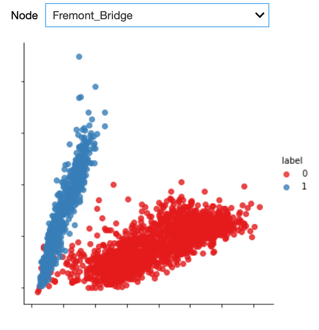

## Outlier Detection
 

<iframe src="https://player.vimeo.com/video/613344630?h=53e3f086f8&color=e700ef" width="640" height="360" frameborder="0" allow="autoplay; fullscreen; picture-in-picture" allowfullscreen></iframe>
 

 

Welcome to the fourth video in the tutorial on advanced visualisation. In this video, we will concentrate on outlier detection. In particular, at which days does the people’s biking behaviour deviate from the expected one.

The visualisations presented in the former videos already allowed us to identify outliers. We saw for example that the traffic at NorthWest 58th Street seems to follow other rules than the other nodes in the network. In this video, we will perform a more detailed analysis of outliers in order to identify them more precisely.

This table presents another way of looking at the data. For each node we have 24 observations per day,
corresponding to the hourly total number of bike passings through that node. As humans, we cannot easily interpret such a table by just staring at it. However, it is also difficult to visualise such data because it is multi-dimensional meaning that it has 24 values for 6 nodes for thousands of days.

However, we can still visualise that data by first performing a so-called dimensionality reduction technique. One of these techniques is Principal Components Analysis or PCA. The idea behind PCA is to find a reduced set of axes that summarize the data.

More concretely, PCA is a statistical procedure that transforms the multidimensional data provided as input into a reduced set of orthogonal - and with that uncorrelated - dimensions. These dimensions are called principal components. By using PCA, we can reduce the dimensionality of the data in the above table to two dimensions and plot the result using a scatterplot, as shown here.

Scatterplots typically visualise two variables of a dataset along the X and Y axis, respectively. Additional information can also be visualised by changing the colour or size of the dots though. Scatterplots are useful to identify relationships between two variables, such as correlation, and to identify separate groups in the data which can be useful for subsequent clustering. The scatterplot shown here has the shape of an 'L' and seems thus to indicate that there are roughly two groups in the data, corresponding to the two line segments forming the shape of that letter.

We can now check in the interactive Starter Kit whether these two groups are present for all nodes. From the above analyses, we might suspect different results for NorthWest 58th Street and 26th Avenue  compared to the other nodes.

Furthermore, the Starter Kit also offers the possibility to change the colormap indicating the day of the week. What kind of colormap would you use to visualise the different days of the week?

Also here, some colorscales work better than others. One the one hand, we could use sequential (YlGn) or diverging (RdBu) colormaps. When applying these to the data, it is hard to distinguish the data from the different days.

These colormaps work better for continuous data, such as the heatmaps that we showed in the previous video. For categorical data as in this figure, a qualitative colormap, like colorblind, works much better. As the name suggests, this colormap has the added advantage that it is very readable for people with varying form of colorblindness.

When using the colorblind colormap for Fremont Bridge, we can clearly see the L-shape. On top of that,
we see that the two arms mainly belong to either weekdays or weekends. The dots corresponding to Fridays seem to be closer to the weekend pattern though.

When we select the data from NorthWest 58th Street, we get a significantly different picture. The two groups are not as clearly separated as before, but Saturdays and Sundays typically correspond to points higher in the figure.

Getting back to Fremont Bridge, also here a couple of weekdays seem to behave like weekend days. We can observe some of these dots in the upper left part of the plot for all nodes. We suspect these latter dots to be outliers. We can automatically identify them by first applying a clustering algorithm for grouping the datapoints in both of the arms together. Then, we can check that the points in each of these two categories correspond to weekend days or weekdays, respectively. Those which do not follow this pattern can be considered outliers. To cluster and hence separate these points we use a Gaussian Mixture Model. It is a clustering technique particularly suited to oval-like shapes like those corresponding to the two categories we would like to separate. As training data, we only consider a single node at a time, but in general, the model can be trained on the data for all the nodes that exhibit the commute pattern. We only do this for those nodes where the two distinct groups could be identified, so not for NW 58th Street and 26th Avenue.

As can be seen from the plot, the Gaussian mixture model is quite good in separating the two groups. With the colours indicating the cluster, we can easily identify the outliers, that is those days that are actually weekdays but that are assigned to the weekend day cluster.

The heatmap plot shows the date corresponding to those outliers. By further checking the US federal holiday calendar, we can see whether the resulting dates corresponded to a holiday, in which case the name of the holiday is indicated on the Y axis.

We can see that all outliers can be explained: either they are weekdays that are actually holidays or weekdays that are other special days, for example the Friday after Thanksgiving, the days before and after Christmas, and New Year's Eve. Note that not all holidays are identified as outliers, for example Thanksgiving should occur every fourth Thursday of November, but we did not identify it as an outlier in 2016, 2017 and 2018. This might be due to an inaccuracy of the model, which would require a more elaborate preprocessing of the data in order to resolve this, yet this is out of scope of this Starter Kit.
