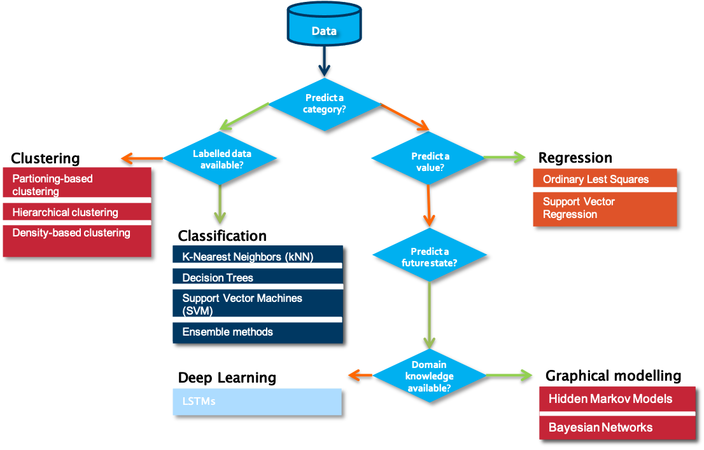
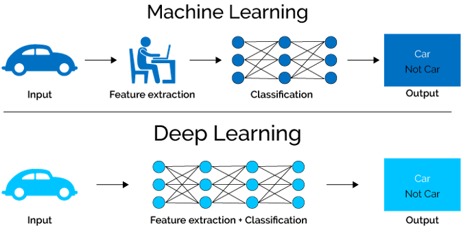
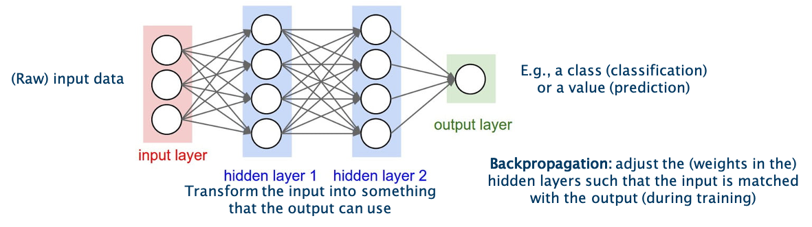
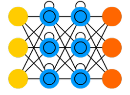

## Deep Learning Theory
 

<iframe src="https://player.vimeo.com/video/595326087?h=1f64dbe31e&color=e700ef" width="640" height="360" frameborder="0" allow="autoplay; fullscreen; picture-in-picture" allowfullscreen></iframe>
 

Data Science, Machine Learning, Deep Learning, Artificial intelligence… These words are often used interchangeably in different contexts and not always precisely. Therefore, before we continue with our particular use case, we will provide you with a brief introduction into the difference between “traditional” machine learning methods and Deep Learning-based techniques. Subsequently we will introduce you to the main neural network types that are used in deep learning, and explain you we selected the appropriate type for use in the context of remaining useful lifetime prediction.

When starting on a data science problem, you usually need to start with finding the answer to a number of questions before starting the hands-on work on the data. Without understanding the use case, even the best data science model will not help. In most cases, a particular business problem can mapped onto one of the following data science tasks. A first question to answer in that respect is which type of outcome is expected from the use case owner.

Is the aim to predict a category, such as ‘normal’, ‘degrading’ or ‘failed’? If yes, the next question to answer is whether labelled data is available or not. Labelled data is data for which examples are available that are annotated by a domain expert with one the classes to predict. Put differently, for each data point or set of data points, a class is defined. Usually, the number of unique classes is rather small. This data will be used by the algorithm for training a model. Once trained, it can be evaluated on a test data set, for which the classes are known but will not be visible to the model. Evaluating the ratio of correctly predicted classes gives a measure of the quality of the model. Often used algorithms for classification are k-Nearest Neighbors, Decision Trees or Support Vector Machines.

But what can we do if we don’t have information available on possible classes? In that case, introducing a similarity between the examples that you have available makes it possible to cluster different data points into groups. These groups can then be used to gain deeper insights into the data, and in some cases can be mapped to particular classes. Partition-base clustering, hierarchical clustering or density-based clustering are often used techniques for this purpose.

The situation is different in case a numerical value should be predicted. It is similar to the classification task, but the prediction range is continuous. For these so-called regression tasks, Ordinary Least Squares or Support Vector Regression are often used.

If the goal is neither to predict a class nor a numerical value, but rather a future state, one typically turns to graphical modelling algorithms order to predict these states. These techniques also allow one to include the available background knowledge into the modelling process. Examples of graphical modelling techniques are Hidden Markov Models and Bayesian Networks.

To make the difference between the single categories a bit clearer, we discuss some examples:

- In case no labelled data is available, clustering of data points can provide insights in different modes in the data. An example is a performance benchmarking of industrial assets. Let’s assume the data to analyze comes from a wind turbine park. When looking at several measurements, like for example of the power curve, the wind speed, and the wind direction, we can identify different modes in which the single wind turbines are operating.
- In contrast, assume that we are interested in the expected power production of a particular wind turbine in the following days for which we have a weather forecast. We can use this information as input variables for a regression model and therewith predict the power production.
- If labels are attached to the gathered data, for example on the root cause of particular sensor failures, a classification algorithm can be used to train a model that is able to determine which fault is associated with a certain set of sensor readings.
- When next to the data also background knowledge from a domain perspective is available, graphical models can for example be used to diagnose the reason behind a particular fault in industrial assets such as wind turbines.

How do the above examples differ from Deep Learning and when does it make sense to use the one or the other? One of the major constraints in traditional machine learning is given by the fact that domain knowledge is usually needed in order to perform proper feature extraction. Consequently, feature engineering is typically a manual and time-consuming task, requiring the necessary domain knowledge. There is hardly any case in which a model can be applied to the data as it is and receive good results. In a number of cases, however, the domain knowledge on a particular problem setting is limited or the machine or process generating the data is highly complex, making it hard for an expert to manually come up with useful characteristics that can be used as features for a machine learning model. This is where deep learning comes into play. In deep learning, the feature extraction and selection step is basically performed by the algorithm itself.

The technique is inspired by the neural networks in human brains. It should learn by itself how to combine the different neurons in the single layers in order to obtain the best results.  The learning is performed by the adjustment of the weights between the neurons in single layers. In the figure, these weights are symbolized by the arrows going from one neuron in one layer to another neuron in the next layer. The final result is given by the output in the output layer, indicated in green in the figure. The textbook example is the classification of images of animals, to discern cats from dogs.

Nowadays there is a whole spectrum of different model architectures and flavours of neurons depending on the type of task that is supposed to be solved. The choice for a particular type of network typically depends on the problem you want to solve, the characteristics of your input data and the availability of particular domain knowledge. All these factors influence amongst others the complexity of the network, its interpretability and the learning speed.

One of the simplest models is a so-called feedforward neural network as shown in the figure. As the model learns by adjusting the weights between the layers, the weights can be seen as its memory. While such models perform well for quite a number of problems, one downside is that their memory is rather static, due to which they have a hard time in ‘remembering’ patterns that happened a long time ago. Suppose that you need to learn a model to predict the sales of Christmas trees. It might be clear that hardly any Christmas tree will be sold in summer, and the main indicator for the sales this year will be the sales figures of the previous years in the month before Christmas. Remembering this long-term information is not easy for a feedforward neural network.

One way to overcome this problem is the usage of so-called Long Short-Term Memory - or LSTM in short - networks. As the name already indicates, LSTM networks are able to adapt their memory in a more precise way than feedforward neural networks, and in this way are better able in deciding which information they need to remember for a longer period of time.
LSTM networks are often used to solve tasks such as unsegmented, connected handwriting recognition, speech recognition and anomaly detection in network traffic or intrusion detection systems.

Also in the field of remaining useful lifetime, the implementation of LSTM networks is reasonable as we deal with data for which the change over time of several variables is decisive. Our interactive starterkit offers the possibility to build your own LSTM model. It allows to gain a deeper understanding of the different parameters and examine how they influence the prediction result.
