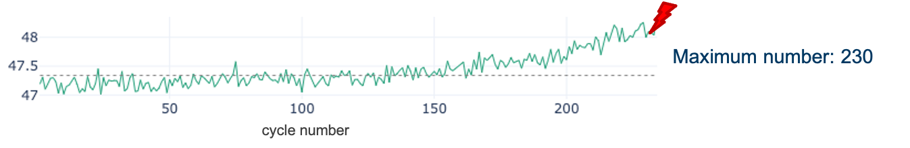
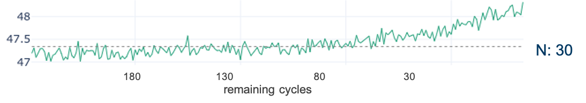
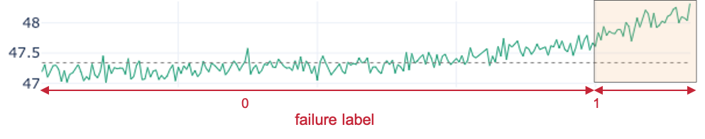
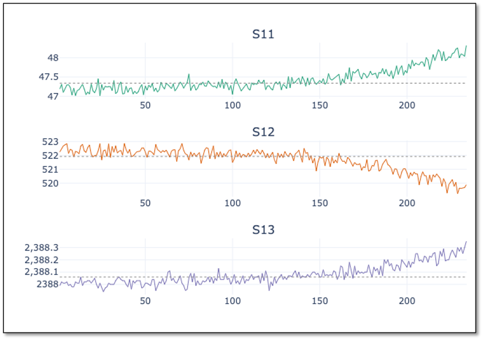

## Data Preprocessing
 

<iframe src="https://player.vimeo.com/video/595333767?h=4fc4eaa9dd&color=e700ef" width="640" height="360" frameborder="0" allow="autoplay; fullscreen; picture-in-picture" allowfullscreen></iframe>
 

 

Welcome to the fourth video of the tutorial for the AI Starter Kit on remaining useful lifetime prediction! In this video, we will explain you how the data needs to be preprocessed such that it can be served as input for a machine learning algorithm.

Let’s get back to the NASA Engine data and our use case.
Before we can start with training a model to predict the remaining useful lifetime, a number of preparatory steps need to be taken. First of all, let us assign which type of problems we are dealing with. What precisely are we interested in? Is it about predicting a categorical value, which can take only a limited set of possible values, or a number?

Indeed, it’s not so easy to answer. It depends on how we define our use case: We can either ask: How long is the remaining useful lifetime? Then, a real number is looked for, and we deal with a so-called regression task. Alternatively, we can ask: Will the engine fail within the next 50 cycles? Then this boils down to a so-called binary classification task, in which the prediction is ‘yes’ or ‘no’. The choice for one or the other task mainly depends on the business question you want to solve. In most cases, a binary classification problem is easier to handle for a Machine Learning algorithm and therefore, this is the question we will answer in this AI Starter Kit. However, the solution methodology is largely similar when you would opt for predicting the remaining useful lifetime using regression.

In the previous video, we explained that for classification tasks, labelled data is essential. Therefore, as a first step, we need to create the binary labels: Has the machine failed within a given period of time or not?

For the training data, we know that the final cycle per engine id is the time of failure.
In order to determine the remaining number of cycles at each time point, first the maximum number of cycles per engine is determined. Subsequently, the current cycle number is subtracted from the maximal number of cycles to arrive at the number of cycles remaining at a particular time point.
[Can we visualize this nicely on a screen on an example? à Show a timeline next to the dataframe, annotated with max/number of cycles/labels]

We will add this value as a new variable to the data. However, this is not yet a binary label that can be used as input for the classification model we want to train. This is created by determining whether the calculated remaining useful lifetime is smaller than or equal to the threshold N – the period of time we want to predict the failure in. In this tutorial, we will use 30 cycles as a threshold, meaning that we aim to answer the question whether or not the engine will fail within the next 30 cycles at a particular point in time.

This binary label can now be used as input value for the classification model. In order to decide on the goodness of the model, the test data needs the same type of label. In that case though, the final cycles per engine does not automatically determine the time of failure. How can we proceed instead?

The ground truth data helps in this case. By joining the unlabelled test data and the ground truth data, we know the time of failure. Once done, we can analogously to the training data calculate the binary label for the test data. Don’t forget, these labels will only be used for evaluating the model and are not shown to the algorithm beforehand.

A second observation that can be made from the training data sample is that the scales of the values differ significantly across columns – both for sensor values and machine settings. This difference in the scale of the numbers could cause problems when the model needs to calculate the similarity between different cycles - namely the rows in the table - during modeling. To address this problem, we will normalize the data. The goal of normalization is to change the values of numeric columns in the dataset to use a common scale, without distorting differences in the ranges of values or losing information. The normalized values maintain the general distribution and ratios in the source data, while keeping values within a scale applied across all numeric columns used in the model.

One of the most popular normalization techniques is so-called Min-Max normalization and that is also what we will use here. It scales the values of a variable to a range between 0 and 1 using this formula

where 𝑋 represents the value to be normalized, 𝑋𝑚𝑖𝑛 is the minimum value of the variable in that column and 𝑋𝑚𝑎𝑥 is the maximum value for that variable
We apply the normalization on both the training and test data set on all sensor measurement and setting variables. We will not rescale the engine id, as it should be seen as a categorical variable. Further, for the cycle variable we keep both the original and the scaled values.

In the next video, we will go to the core of this tutorial, namely using a deep learning algorithm to train a model that is able to solve this binary classification problem.
