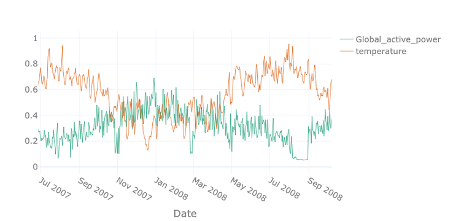

## Introduction
Welcome to the tutorial for the AI Starter Kit on resource demand forecasting.
In this first video we will provide an overview of the actual business case we are tackling. We will introduce the most important concepts and explain why it is beneficial for resource planning to know the expected demand in the future.



Resource demand forecasting concerns accurately predicting the future need for a resource, typically using historical information. It is one of the most essential steps in resource demand management, which tries to ensure that sufficient resources are available to satisfy a fluctuating demand. Resource demand forecasting allows one to plan ahead and guarantee that sufficient resources are available when needed and to avoid costly countermeasures in case of shortage.

Precisely forecasting the demand of a given resource can be beneficial for several purposes in a wide range of industrial contexts. When knowing the future demand, only the number of resources actually required need to be allocated to a specific task or process. The field ranges from forecasting the number of products that need to be manufactured based on historical sales figures, over predicting the parking demand or traffic density in a particular neighbourhood in order to control traffic in more intelligent ways, to estimating the amount of energy that will be consumed and produced for a particular city or region.

Especially in the later field, the demand is influenced by a mixture of external factors such as the weather conditions. For energy suppliers it is more beneficial to buy electricity on the day-ahead market than on the spot market. Consequently, the more accurate the energy consumption can be predicted, the lower the cost. Given that more and more houses and appliances are enabled with a smart meter, an increasing amount of data becomes available that can enable and improve this prediction. Furthermore, these kinds of predictions also allow energy suppliers to better balance demand and supply and helps them to ensure proper grid operation, but also to avoid negative prices, for example in times of high solar irradiation.

In this example we see the active power of a single household near Paris shown in green. In orange, the outside temperature is given. The two are strongly correlated – the demand increases with decreasing temperatures since most French households use electrical heating. Therefore, particularly in winter times, the grid has to be stable when facing high demands.

In this Starter Kit, we will demonstrate how to effectively forecast the demand for this household for the future by taking external factors into account. In the following videos, we will first start by gaining some first insights in the data in front of us and perform some initial pre-processing steps to prepare the data for the analysis. Subsequently, we will illustrate you how to gain deeper insights by presenting a number of visual and statistical techniques in order to explore the data for identifying interesting patterns. In a next step, useful characteristics or features will be extracted from the dataset that can as serve as input for the forecasting models. Finally, in the last video, we will explain you how to correctly compare the performance of multiple forecasting models.

Let us go ahead with the next video on data preparation, in which we will describe how to deal with the typical problems of raw data and how to perform data fusion when multiple sources of data are available.

## Additional information

The video material in this website was developed in the context of the [SKAIDive project](https://elucidata.be/skaidive), financially supported by the [European Social Fund](https://www.esf-vlaanderen.be), the European Union and Flanders. For more information, please contact us at <elucidatalab@sirris.be>
