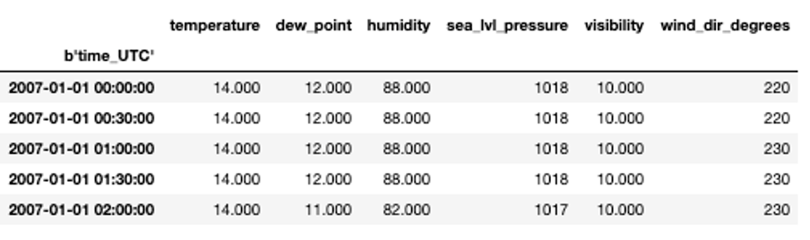
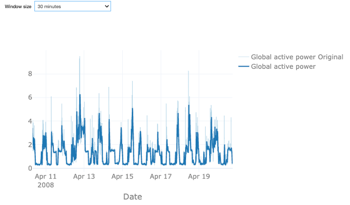
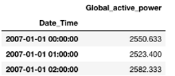
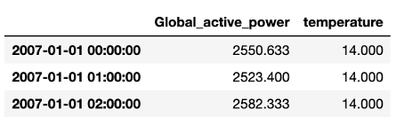

## Data Preprocessing
Welcome to the second video of the tutorial for the AI Starter Kit on resource demand forecasting! In this video, we will detail the dataset that we will use and perform the necessary preprocessing steps in order to prepare the data for further analysis.



In this AI Starter Kit, we will work with a publicly available energy consumption dataset from the UCI repository. This dataset contains measurements of electric power consumption in one household, located near Paris, with a one-minute sampling rate over a period of almost 4 years. Different electrical quantities and sub-metering values are available, as you can see in the table.

Let us first have a look at the single variables given in the table:
First of all, and most importantly, the global active and reactive powers are given. The active power specifies the amount of energy the single electric receivers transform into mechanical work and heat. This useful effect is called 'active energy'. On the contrary, several receivers, such as motors, transformer, or inductive cookers need magnetic fields in order to work. This amount is called reactive power as these receivers are generally inductive: This means, they absorb energy from the network in order to create magnetic fields and return it while they disappear. This results in an additional electrical consumption that is not useful for the receivers.
Further, the voltage and current intensity are given in Volts and Ampere, respectively.
Finally, the submeterings provide us a more detailed insights where the power is consumed. Submetering 1 corresponds to the kitchen, containing mainly a dishwasher, an oven, and a microwave. Submetering 2 corresponds to the laundry room, containing a washing-machine, a tumble-drier, a refrigerator and a light. Lastly, submetering 3 corresponds to an electric water-heater and an air-conditioner. We expect, that the different submeterings obey different patterns: While an oven mainly consumes power during lunch and dinner time, a refrigerator has a more or less constant consumption during the entire day.

As mentioned before, we will also take weather measurements into account. For this, we use measurements recorded close to the city of Paris, where the household is located, provided by the Wunderground website. It contains information on climate conditions on a 30-minutes base.

The dataset contains the outside temperature and the dew point in degrees Celsius, the air humidity in percentage, the pressure at sea level in hPa, the visibility in km and the wind direction expressed in degrees. The weather data is measured by a set of connected sensors. For these, it is rare that the data availability is uninterrupted for such a long period.

For this reason, we first check the general statistics for the data set. For most variables, the minimal value is -9999, which indicates missing values as also specified in the documentation of the data. We will replace these with so-called 'Not a Number' values or NaNs such that they will not interfere too much during data modelling.

In a next step, we fuse the electricity data and the weather data. Note, that the temporal resolution of the two is not the same – the power data is measured every minute while the weather information is available only every 30 minutes. The integration of these two datasets thus requires careful consideration.

Two options are possible: we can either upsample the weather data or downsample the household data. That means that we either linearly interpolate the information from weather data on a one-minute interval or aggregate the power data on bigger intervals. In this use case, the latter is more reasonable, as otherwise, we would need to find a way to impute missing data in the climate dataset.

Let us first analyze the effect of downsampling the power data. Therefore, we calculate the rolling mean values of the original power over a given time window. You can choose between a sampling rate of 30 or 60 minutes, or 4 hours. The light blue time series shows the original data, the dark blue one the downsampled one. In all cases, the data looks smoother as the original data, as taking the mean value smooths out the major short-time power peaks but at the same time results in some loss of information. With the larger window size of 60 minutes this effect is stronger than for the smaller one. A window size of 4 hours arguably removes too much variation. Note that the weather data is available every 30 minutes such that in case of an hourly time window for the power data also the weather data has to be resampled. Since the information loss for the 60-minute interval is reasonable, we decide to proceed with this sampling rate. This also allows us to reduce the size of the dataset, which will reduce the computation time required for the analysis.

In order to merge the two data sets, we transform the active power from a minutes-based power measurement given in kW to an hourly consumption given in Wh. Therefore, we sum the power over one hour and divide it by 60 to get the actual energy. By additionally multiplying by a factor of 1000, we change units from kWh to Wh.

For the weather data, we proceed similarly by taking the mean temperature over one hour.
With this, we can join the two data sets. For future analysis, we will only take the global consumption and temperature into account.

Now that we have preprocessed the dataset, we will illustrate how to gain deeper insights in the data through both visual and statistical data exploration. In the next video, we will start with the visual exploration by means of time plots.

## Additional information

The video material in this website was developed in the context of the [SKAIDive project](https://elucidata.be/skaidive), financially supported by the [European Social Fund](https://www.esf-vlaanderen.be), the European Union and Flanders. For more information, please contact us at <elucidatalab@sirris.be>
