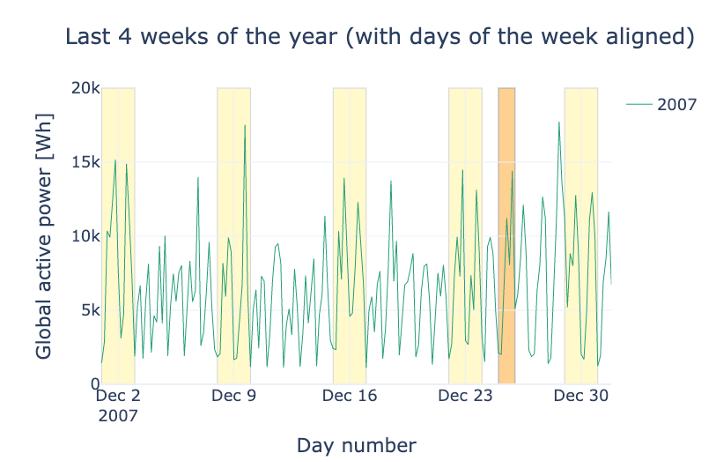

## Visual Data Exploration
Welcome to the third video of the tutorial for the AI Starter Kit on resource demand forecasting! Let us now explore the extended dataset in order to understand which factors influence the household energy consumption. Based on this exploration, we will later on identify which features are useful for training a machine learning model to forecast energy consumption.



Time plots are a common way for exploring time series data, such as the energy consumption that we consider here. We explore time plots in different time frames in order to highlight different seasonal patterns in the data.

We start with a yearly plot, which allows us to identify global patterns.
Then, a monthly plot allows us to zoom in and understand relationships between energy consumption in different weeks and days along the year.
And finally, a weekly plot allows us to zoom in even further and identify daily and hourly patterns.

We start with the yearly plot. The data ranges from January 2007 to end of 2010. We can easily see the yearly pattern for the global active power with peaks in winter and valleys in summer. With these settings though, we see the temperature values only as a flat line because they are about two magnitudes smaller. When only displaying the temperature, we see a similar pattern with high values in summer and low values in winter, as expected.
In order to make the two-time series comparable, we normalize the data, such that the maximal value of each time series corresponds to 1 and the lowest one corresponds to zero.
Like this, we can see that the two show an opposite evolution over the year.

For the monthly data, we progress analogously. While we can again clearly see the annual effect, there is no clear pattern recurring every month. One interesting thing that can be observed is that strong dips in power consumption tend to happen at the same time in February and November in 2007 and 2008. Most likely, these are holidays which tend to happen at the same time for the household under investigation. This can be best seen when the sampling rate is changed. Instead of showing the data per day, we can have a look at the rolling mean of the active power over three days to see the pattern more clearly.

We further explore the evolution of the energy consumption in a shorter time frame. We want to verify whether during a week, the energy consumption exhibits the same patterns.

In the following plot, the user can inspect and compare the energy consumption in December of different years. We mark weekends in yellow and Christmas day in orange. What can you notice when you compare weekdays and weekends? And how about the holidays?

Exactly, the mean consumption is higher on the weekends. The reason might be that more members of the household are at home during the weekends. Comparing the week around Christmas 2008 and 2009 shows interesting patterns. While the household was obviously at home and maybe even with guests in 2009, it looks like they were not around in 2008 for several days.

Finally, we analyze the daily pattern. For this, rather than showing the resampled dataset, we use the original dataset, which provides consumption with a sampling rate of 1 minute and which can show more detailed patterns. Note that this means we are using the original units of kW. In the figure, we see how the power consumption follows a daily recurring pattern, with peaks in the morning and evening and troughs at night and noon – on weekdays. The 5th of December was a Saturday, and we can clearly see how the curve of that day deviates from the weekdays.

During the night, we still see a low and more or less constant power usage, most likely due to appliances like refrigerators that run continuously.

In the next video, we will discuss the statistical significance of the patterns detected and prepare the data for machine learning modelling by extracting meaningful characteristics or features.

## Additional information

The video material in this website was developed in the context of the [SKAIDive project](https://elucidata.be/skaidive), financially supported by the [European Social Fund](https://www.esf-vlaanderen.be), the European Union and Flanders. For more information, please contact us at <elucidatalab@sirris.be>
