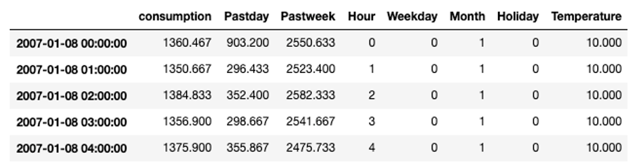

## Statistical Data Exploration and Feature Engineering
In the former video, we performed a visual data exploration. We could already gain quite some insights from the figures we showed. In this video, we will concentrate stronger on statistics in order to verify our findings. Finally, we will prepare the datasets for modelling purposes by extracting a number of distinguishing features which will serve as input for the machine learning algorithm.



In order to find repetitive patterns in time series data, we can use autocorrelation. It provides the correlation between the time series and a delayed copy of itself. In case of a perfect periodicity as shown in the figure, the autocorrelation equals 1 if we delay one copy by the periodicity.

In order to investigate the autocorrelation in case of the global active power, we visualize the autocorrelation with time lags of 1 day, 2 days, and so on. Note that we do not show the results of a delay of 0 days, since the correlation with the exact same day would trivially be 1.  For bigger delays, a clear peak occurs after 1 day, indicating the consumption of a day is highly correlated with the consumption of the previous day. And more obviously, several peaks occur every 7 days, which confirms the existence of a weekly pattern. That means that the consumption of a day is highly correlated with the consumption of the same day one or several weeks earlier.

In the data exploration video, we further saw that the temperature and the global active power show an opposite trend. In order to verify the strength of this relationship, we can compute the correlation between these two variables. For this purpose, we compute Pearson's correlation.

The Starter Kit allows to calculate the correlation between the temperature and the global active power for different resampling rates. Why is this important? One reason is the time scale for changes. The temperature typically changes less drastically over time than energy consumption does.
In the figure, on the diagonal, we see the correlation of the two time series with each other, resulting in a perfect correlation of 1 as expected. On the opposite, along the antidiagonal, we see the correlation between the global active power and the outside temperature. In case of a sampling rate of 1 hour, the negative correlation is weak with roughly -0.2. With an increased resampling rate of 1 week, the negative correlation is more evident with a value of -0.75. This confirms our insight from the visual inspection. With a larger sampling rate, the short-term fluctuations – for example from your washing machine – are smoothed out and leaves us with the seasonal pattern.

From these insights, we can now start extracting features from the extended dataset that we can use later on for the electricity consumption forecasting. A feature is an individual measurable property of the phenomenon being observed. Choosing informative, discriminating, and independent features is a crucial step for building effective machine learning algorithms. Based on the previous visual and statistical observations, we will consider the following features to predict the energy consumption for the hour ahead:

* energy consumption of the day before because we saw that there was a peak in the autocorrelation with a delay of one day;
* energy consumption of the 7 days before due to the weekly pattern;
* the hour of the day, which will allow to distinguish between different periods of the day (i.e., night, morning, afternoon, evening);
* the day of the week, which will allow to distinguish between weekdays and weekend days
* whether the day is a holiday or not;
* the month of the year, which will allow to distinguish between yearly seasons; and finally,
* the temperature.

That results in the final dataset that will be used as input for the machine learning algorithm to learn the model.

Before discussing the modelling step in more detail, in the next video, we will provide a theoretical overview of the approaches chosen for the electricity consumption forecast.

## Additional information

The video material in this website was developed in the context of the [SKAIDive project](https://elucidata.be/skaidive), financially supported by the [European Social Fund](https://www.esf-vlaanderen.be), the European Union and Flanders. For more information, please contact us at <elucidatalab@sirris.be>
