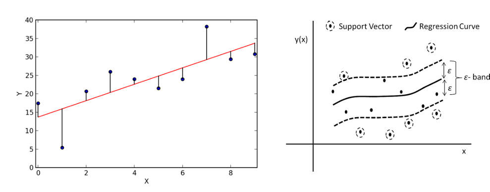

## Data Science Theory: Advanced Regression Models
Before deciding on the most appropriate algorithm to solve a particular data science problem, a first step is to decide which type of task you are trying to solve. In order to do so, you usually need to start with finding the answer to a number of questions, based on the case under consideration. Without a clear understanding of the use case, even the best data science model will not help.



A first question to answer in that respect is which type of outcome is expected from the use case owner.

Is the aim to predict a category, such as ‘normal’, ‘degrading’ or ‘failed’?

If yes, the next question to answer is whether labelled data is available or not. Labelled data is data for which examples are available that are annotated by a domain expert with the classes to predict.

Put differently, for each data point or set of data points, a class is defined. Usually, the number of unique classes is rather small. This data will be used by the algorithm for training a model. Once trained, it can be evaluated on a test data set, for which the classes are known but will not be visible to the model. Evaluating the ratio of correctly predicted classes gives a measure of the quality of the model. Often used algorithms for classification are k-Nearest Neighbors, Decision Trees or Support Vector Machines.

But what can we do if we do not have information available on possible classes? In that case, introducing a similarity between the examples that you have available makes it possible to cluster different data points into groups. These groups can then be used to gain deeper insights into the data, and in some cases can be mapped to particular classes. Partitioning-based clustering, hierarchical clustering or density-based clustering are often used techniques for this purpose.

The situation is different in case a numerical value should be predicted. It is similar to the classification task, but the prediction range is continuous. For these so-called regression tasks, Ordinary Least Squares or Support Vector Regression are often used.

If the goal is neither to predict a class nor a numerical value, but rather a future state, one typically turns to graphical modelling algorithms in order to predict these states. These techniques also allow one to include the available background knowledge into the modelling process. Examples of graphical modelling techniques are Hidden Markov Models and Bayesian Networks.

To make the difference between the single categories a bit more clear, we discuss some examples:

In case no labelled data is available, clustering of data points can provide insights in different modes in the data. An example is performance benchmarking of industrial assets. Let’s assume the data to analyze comes from a wind turbine park. When looking at several measurements, like for example of the power curve, the wind speed, and the wind direction, we can identify different modes in which the single wind turbines are operating.

In contrast, assume that we are interested in the expected power production of a particular wind turbine in the following days for which we have a weather forecast. We can use this information as input variables for a regression model and therewith predict the power production.

If labels are attached to the gathered data, for example on the root cause of particular sensor failures, a classification algorithm can be used to train a model that is able to determine which fault is associated with a certain set of sensor readings.

With this knowledge, we can decide which type of algorithms is suitable for the forecasting of electricity consumption. Let us use the decision tree for this:

Do we want to predict a category?

No, right, we are looking for a continuous value. So, we go to the right. And yes, we need to predict a value. Therefore, it is a regression task we are facing here. The question we want to answer is precisely: How much electricity will be consumed in the next hour, taking into account historical information regarding the electricity consumption and the outside temperature?

There is a bunch of regression algorithms that can be used in various contexts. In our case, we have a comparably small feature set and all of them are numerical. Therefore, we will go for two commonly used algorithms for the prediction, namely Random Forest Regressors and Support Vector Regressors. We will introduce both algorithms in more detail in the remainder of this video.

### Random Forest Regression

We start with Random Forest Regression. The base to build a random forest is a decision tree – which works similarly to the one we just used to determine which class of algorithms is suitable for the electricity forecasting. Since in a random forest, the model is defined by a combination of trees, it is a so-called ensemble method. Ensemble methods help improve machine learning results by combining several models. This approach allows the production of better predictive performance compared to a single model. From each decision tree a value is predicted, and the final prediction will be a weighted function of all predictions.

Here we see a very simplistic version of a random forest regressor with only three decision trees. All trees are trained in parallel and each one will predict a value for a given set of input variables. The final prediction in this case would be the mean value of all predictions, ergo 10,67.

In order to improve the performance of a model, you need to tune the algorithm’s hyperparameters. Hyperparameters can be considered as the algorithm’s settings, or put simply, the knobs that you can turn to gain a better result. These hyperparameters are tuned during the training phase by the data scientist. In the case of a random forest, the most important hyperparameters include the number of decision trees in the forest, the maximum depth of each of these trees, and the minimum number of examples and maximum number of features to consider when splitting an internal node in one of these trees.

### Support Vector Regression

Another type of regression approach is support vector regression. While support vectors are mainly used in the field of classification, with some adaptions, it also works for regression tasks. It works similarly to an ordinary least squares regression where the linear regression line is targeted with the smallest overall deviation from the data points. This is very handy in case of linear dependencies and for clean data. But as soon as there are several outliers in the data set or the relation between the data points is non-linear, the quality of the model can decrease significantly. Especially in the context of industrial data, this can never be fully avoided. For Support Vector Regression a band of width epsilon ε is defined. We call that band the *hyperplane*. The aim is to search the hyperplane that includes most points while at the same time the sum of the distance of the outlying points may not exceed a given threshold. The training instances closest to the hyperplane that help define the margins are called *Support Vectors*.

As for random forest regression, also support vector regression has a number of important hyperparameters that can be adjusted to optimize the performance. A first important hyperparameter is the choice for the type of kernel to use. A kernel is a set of mathematical functions that takes data as input and transform it into the required form. This kernel is used for finding a hyperplane in a higher dimensional space. The most widely used kernels include Linear, Non-Linear, Polynomial, Radial Basis Function (RBF) and Sigmoid. The selection of the type of kernel typically depends on the characteristics of the dataset. The cost parameter C tells the SVR optimization how much you want to avoid a wrong regression for each of the training examples. For large values of C, the optimization will choose a smaller-margin hyperplane if that hyperplane does a better job of getting all the training points predicted correctly, and vice versa. The size of this margin can be set by epsilon, which specifies the band within which no penalty is associated in the training loss function with points predicted within a distance epsilon from the actual value.

Now that we gained some more knowledge on these two frequently used regression approaches, in the next video we will explain how to train a regression model for our household energy consumption prediction problem.

## Additional information

The video material in this website was developed in the context of the [SKAIDive project](https://elucidata.be/skaidive), financially supported by the [European Social Fund](https://www.esf-vlaanderen.be), the European Union and Flanders. For more information, please contact us at <elucidatalab@sirris.be>
