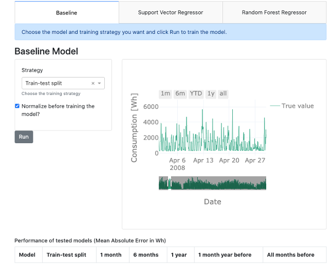

## Data Modelling and Forecasting
Now that we gained the necessary insights from the data, extracted a number of meaningful features, and gained some theoretical background on regression models, we will use the AI Starter Kit to discover the most important factors for training a machine learning model. More specifically, we will analyze the influence of the training strategy, type of machine learning model and effect of data normalization on the model performance.



To evaluate the performance of the models the mean absolute error or MAE is used - a metric commonly used in literature for this purpose. This metric quantifies to what extent the model forecasts are close to the real values. As the name suggests, the mean absolute error is an average of the absolute errors. It holds that the lower the MAE of the model, the better its performance.

As just mentioned, the training strategy, the machine learning model and the data normalization may influence the quality of the predictions. Before we start training a model, let us dive a bit deeper in these three influences.

First of all, let us turn to the training strategy. The training data typically highly influences quality of the model. Therefore, in this starter kit, we will experiment with six different training strategies, to study their influence on the quality of the resulting model.

First, we will use 1 month before the test month as training data. In the Starter Kit, several models are trained for the predictions of each individual month. Each model is trained on one month before the month we are making predictions for. A one-month gap is introduced between the training and the test month in order to avoid that the last day of the training set is also included in the first day of the test set. For example, the models that will make the predictions for April 2008 will be trained on the data from February 2008.

Secondly, we will use 6 months before the test month as training data. This is thus highly similar to the above experiment, but with 6 months of training data. It still includes a 1-month gap. Or we can go back even further in time and use 1 year before the test month as training data.

Similarly, we can use 1 month the year before as training data. This is similar to strategy number 1, but with a gap of 11 months. This way, the training data and test data are taken from the same month, one year apart.

Further, we can also use all months before the test month as training data. For each test month, a model is trained using all the data prior to this (including a 1-month gap). This strategy simulates the scenario where the model is retrained as new data comes in. Since this requires training several models based on potentially large training sets, this might require a certain computational time.

Finally, we experiment with training on the first year of data and make predictions on the rest. This strategy is commonly used for training these kinds of models.

With these training strategies, we will see how strongly the amount of data but also the seasonal pattern will influence the quality of the model.

As already introduced in the former video, we will train two different types of models, namely a Random Forest Regressor and a Support Vector Regressor. Besides these models, we will also use a simple benchmark model that we use to compare the performance of the models against. For the prediction of the energy of a certain day, this benchmark model simply takes the energy consumption of the previous day at the same time. Note that for this approach no model is built and consequently it does not include any training phase.

Finally, a short note on normalization. We saw already in the video on data understanding that the scale for the outside temperature and global active power are quite different. This is also true for the remaining features that we introduced. Therefore, it might be necessary to normalize the data, that is, rescale it such that all input and output values are between 0 and 1. This is indeed a requirement for the correct training of some machine learning models. We will test in the Starter Kit whether it makes a difference for the models suggested.

At first, let us run the baseline model as we will later on compare all model results to these results. The mean absolute error is 604.45. Putting this number into relation with the mean global active power of 1118, the error is comparably high. For reasons of comparability, each result will be shown in the table just below the interface.

As discussed above, we first want to analyze the influence of the training strategy. Therefore, we train the Support Vector Regressor on strategy 1, so for 1 month of data, and on strategy 2, for 6 months of data. In this first experiment, we will not normalize the data beforehand. For both strategy 1 and 2, the mean absolute error is even bigger than for the benchmark model. Therefore, we are going to use the normalized data instead. With that, the model predictions improve and for both strategies, this results in better forecasts than the baseline model. We can do the same for the Random Forest Regressor. We train if for both strategies – namely strategy 1 and 2 – and on the normalized and non-normalized data. In all four cases, the results are better than those obtained by both the baseline model and the Support Vector Regressor.
Now it is up to you. Train different models and find out which model returns the best results and which influences are the strongest. If you want, you can pause the video for this.

These are the basic findings when training all models:

Concerning the training strategy, we see that for the Support Vector Regressor the standard train-test split has the best performance, although using all months and using a one-year window before the test month as training data both have a similar performance. Furthermore, we clearly see that using a one-year window before the test month as training data leads to better performance than the other training strategies. We note that for both this "one year window" strategy and the standard train-test split, the training data is one year. The difference, however, is that for the former the training set changes, while for the latter it is fixed meaning that all the data from 2017 is used.

A general trend that can be observed is that the performance increases as a larger training set is used. We therefore urge the user to look at the predictions made using the training strategy where all months before the test month are used as training data: we can expect that the predictions for the later months will be better than for the first months since more training data was used. However, this is hard to see by eye in the prediction plot directly.

Regarding the chosen model, we can see that both the Support Vector Regressor and Random Forest Regressor outperform the simple baseline we set up. Further, the Random Forest Regressor outperforms the Support Vector Regressor for all training strategies. This shows the importance of knowing which model is best suited for your problem and testing different ones. Important to note though, is that no extensive hyperparameter tuning was performed, which could alter this observation. This is required for a proper validation of the algorithms and therefore we encourage the user to also experiment with altering the hyperparameters and study the influence on the results.

Finally, normalizing the data, rescaling it such that the input and output variables all have values within a similar range - in this case, between 0 and 1 - is a common step when setting up machine learning models. This is because, depending on the model, they work much better with values of this order of magnitude. We see that normalization indeed greatly improves the predictions for the Support Vector Regressor but has little influence on the random forest regressor. Indeed, algorithms such as random forests and decision trees are not influenced by the scale of the input variables.

We hope that you have gained more insights on how the training strategy, the type of machine learning model and data normalization influence the model performance and are familiar now with the usage of the interface. We suggest that you try a number of additional combinations of settings and think about in which way they influence the quality of the model.

In the next video, we will summarize the key take away messages and provide you with a number of suggestions for additional experiments to gain additional insights.

## Additional information

The video material in this website was developed in the context of the [SKAIDive project](https://elucidata.be/skaidive), financially supported by the [European Social Fund](https://www.esf-vlaanderen.be), the European Union and Flanders. For more information, please contact us at <elucidatalab@sirris.be>
