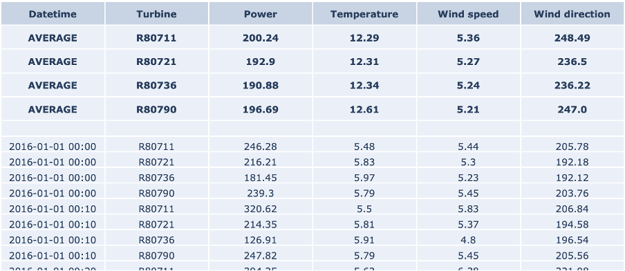

## Data Understanding
 

<iframe src="https://player.vimeo.com/video/596619454?h=55827a6e24&color=e700ef" width="640" height="360" frameborder="0" allow="autoplay; fullscreen; picture-in-picture" allowfullscreen></iframe>
 

 

Welcome to the second video of the tutorial for the AI Starter Kit on time-series pre-processing! In this video,
we will detail the dataset that we will use and perform an initial data exploration. The time series dataset that we study in this Starter Kit is generated by the SCADA system of a set of wind turbines. SCADA stands for supervisory control and data acquisition. In modern turbines, such a data acquisition system can easily contain more than 100 sensors that keep track of amongst others temperature, pressure data, electrical quantities like currents and voltages, and vibrations. It is commonly used for performance monitoring and condition-based maintenance.

The dataset originates from 4 wind turbines located in the Northeast of France. It spans a period of 4 years with a sampling rate of 10 minutes. Although the original SCADA system records statistics for more than 30 sensors, we will focus our attention only on wind speed, wind direction, temperature as well as the power that is generated by each of these turbines to illustrate a variety of time series pre-processing techniques.

The table on the right-hand side shows an excerpt of the data, with the following attributes:
*  The column Date_time with the timestamp of the measurement, in 10-minute increments
* the identifier of the turbine
* Power, which is the active power measurement in kW as effectively produced by the turbine.
*  the outside temperature measurement in degrees Celsius
*  the wind speed measurement in meters per second
And finally
* the wind direction measurement in degrees

The top rows show the average values for each turbine for the defined range. Note that in the case of wind direction,
this is the _circular_ average, which takes into account the circular nature of the data. That means that values are bound between 0 and 360 degrees, in which 0 degrees is identical to 360 degrees.

In our interactive Starter Kit, you can define a range of values for a given attribute and see how the values in the remaining attributes change. For example, we can increase the wind speed to more than 17m/sec and see how that affects power production. Can you already spot any unexpected values in the dataset?

Indeed, in the marked area in the figure, the values are significantly below those seen at other times.

You can experiment yourself how the other variables influence the active power in the interactive Starter Kit. Now that we know which variables were measured, let’s check some statistics.

From the table we learn that in total 4 years of data are available, namely from January 2013 to the end of 2016. Further, we see that the number of data points per wind turbine differs. Most data points are available for the first turbine in the column, while the second turbine collected roughly 1000 data points less. This indicates already that for this latter turbine some data points are missing.

In the interactive Starter Kit, we can plot the values of a given variable in time to see how their long-term trend looks like. In the graph shown at the right, we adjusted the timeframe by selecting it directly in the graph, such that also shorter-term fluctuations become visible. By clicking on the turbine names at the right-hand side of the graph, we can select a subset of the turbines. In the drop-down menu at the top of the graph, the variable to plot can be selected.

What can we learn from this visual exploration? Let’s first have a look at the temperature. Here we can easily spot the seasonal pattern due to summer and winter. Is this behaviour similar for the active power? Is there something unusual you can observe in the temperature values?

We will come back to the answers to these questions later on in this Starter Kit and introduce you to a number of techniques to automatically detect this.

In the next video, we will first concentrate on the smoothening and so-called resampling of the data points. See you there.
