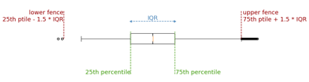
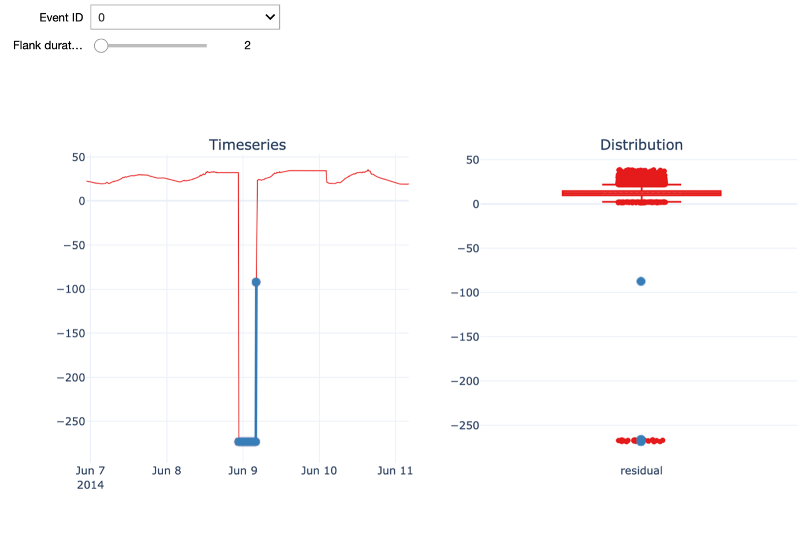
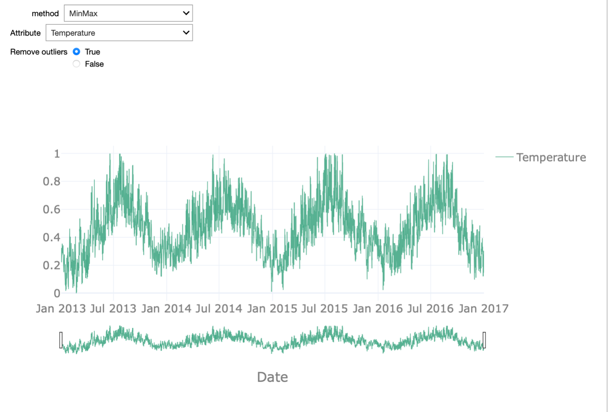

## Outlier Detection
 

<iframe src="https://player.vimeo.com/video/596616333?h=bb150f1b93&color=e700ef" width="640" height="360" frameborder="0" allow="autoplay; fullscreen; picture-in-picture" allowfullscreen></iframe>
 

 

In the previous video we explored the data mainly in a visual manner. In this fourth video,
we will discuss how to detect outliers in the data and how different methods can be used to improve the data quality.

There are several different techniques for outlier detection in time-series. Here, we will focus on online outlier detection, that means the detection of an outlier as soon as it occurs, as opposed to an offline detection,
which happens retrospectively. We present two different approaches for outlier detection using temperature and wind speed variables.

A relatively simple and frequently used approach for outlier detection is based on the boxplot data distribution.

For a given attribute, this method computes its interquartile range or IQR, which is the difference between the 25th and 75th percentiles. This value is then multiplied by a constant factor 𝛼 which determines how stringent the outlier detection is. A typical value for 𝛼 is 1.5, although this value can be adapted according to the level of stringiness desired. Indeed, larger values will push the outlier boundaries further  and thereby reducing the number of detected outliers. The resulting value is subtracted from the 25th and added to the 75th percentiles to obtain the lower and upper fences, respectively, which define the thresholds beyond which a given value is labelled as an outlier.

Considering the seasonal nature of the data, we should ensure that the outlier detection approach takes the impact of seasonality into account. It is known that the temperature has significant seasonal variation as it varies between day and night or between winter and summer for example and the same temperature in winter and in summer can be considered as outlier in one case, but not in the other. Therefore, the seasonal trend decomposition described in the former video is applied to the signal and the residuals are used as input for the outlier detection. In doing so, we only take the distance to the seasonal pattern into account for the outlier detection.

In the example shown on the right, we identify outlier events based on a given 𝛼 value. We define outlier events as outliers that are consecutive in time. An additional input parameter allows to merge outlier events that are separated by less than a given amount of time. When using the most stringent alpha value - in our case – we detect a single outlier in the dataset: namely one of the turbines measured a temperature of -273 degrees for a period of time.

Further, we can visualize the time series around the time of a given outlier event. The Flank duration parameter allows you to control the time window around the outlier for the visualization. The left figure shows the time series
with the outlier event highlighted in blue, while the figure on the right shows the distribution of all the temperature residual values using a boxplot. Again, the points in blue indicate the outlier event depicted on the left. When increasing the flank duration, we clearly see that this measurement is an outlier. Of course,
to identify an outlier with a temperature of -273 degrees, you don’t need data science. Hence, We also have a look at another outlier detected with a smaller value for alpha, namely 1.5.

In this case, the outlier is not as evident as before.
On the 23rd of August, the temperature was much higher than on a normal day in August and warmer than the days before and after.

An important aspect we want to discuss in this respect is the influence of outlier detection and removal on normalization. Normalization is a typical data pre-processing step where the range of a variable is standardized,
meaning rescaled in order to make different variables with different ranges comparable. It is an important pre-processing step before the data is presented to a machine learning algorithm, as it ensures all variables have equal importance.

Different normalization approaches exist. Examples are rescaling the values in the 0-1 range, known as min-max normalization, or removing the mean and scaling to unit variance, known as z-score or standard score normalization. Most of these approaches are sensitive to outliers: For example, in the case of min-max normalization, the minimum value is mapped to 0 and the maximum to 1 so obviously extreme outliers will have a large impact.

In the starterkit, we can test these two normalization approaches on each of the attributes of the dataset. We can enable or disable the outlier removal in order to appreciate how this affects the normalization procedure. This effect is most striking when looking at the temperature attribute.

If we do not remove the outliers, the min-max normalization is meaningless as 0 is mapped onto -273 degrees. All remaining values are then in the range between 0.8 and 1. When removing the outliers, the range between 0 and 1 is equally dense and the normalization reflects the seasonality in the data.

A second approach is the so-called Fleet-based outlier detection.

For detecting outliers of the power attribute, we will use this alternative approach. Note, that this is only for the purpose of demonstration and that we could also use the interquartile range-base outlier detection for the power attribute.

The approach we will use is based on exploiting the fleet aspect, which is exemplified by wind turbines, which typically operate as part of a wind park in the same environment under similar environmental conditions.

At each point in time, we compute the median power recorded by the fleet and we consider any value that deviates too much from that median value to be an outlier. To determine what constitutes too much deviation, we again consider the boxplot outlier definition. If a value is beyond 5 times the IQR from the 25th or 75th percentile, we consider the observation to be an outlier. To exclude periods during which all the turbines in the fleet were not operational, we only consider time points when at least 3 of the 4 turbines recorded a power production above 0.

The starter kit allows us to explore all the detected outliers in the power attribute using this definition. We can change the Flank parameter in order to see a larger time window around the outlier. It can be observed that the outliers often happen in periods of time when the power of a given turbine dropped to 0 without it being the case for the remaining turbines.

There are, nonetheless, other instances, when the produced power of a given turbine was - statistically speaking – above what would be expected given the behaviour of the remaining turbines. Note that the grey square highlights only the fleet outlier event in question. Other points in the visualization might also be labelled as outliers but they are not part of the same event.

The fleet-based approach has the advantage of being able to capture outliers at a specific moment in time only relying on sensor values captured at that time. On the contrary, this approach can only be applied if the dataset contains a fleet of co-located assets, meaning that they are exposed to similar conditions.

In the next video, we will discuss how we can impute missing data in the dataset and therewith improve the quality of the data.
