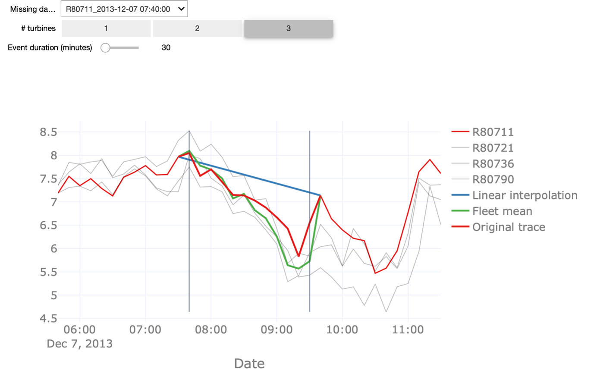

## Handling Missing Data
 

<iframe src="https://player.vimeo.com/video/596617563?h=1e5b81dc2c&color=e700ef" width="640" height="360" frameborder="0" allow="autoplay; fullscreen; picture-in-picture" allowfullscreen></iframe>
 

 

In this video, we will finally use the insights from before and impute missing values in the dataset.

Real-world industrial datasets often suffer from missing data due to several reasons. Missing data occurs often due to sensor malfunctioning or communication errors. In addition, if we have removed outliers as shown in the previous video, these will also show up as missing values in the data.

In both cases, we can fill the missing values using so-called data imputation techniques. Multiple techniques exist and which one to choose depends on the data characteristics. The choice depends on the presence of trends, the length of the missing period, etc. In this video, we will present 3 different imputation techniques, namely
* Linear interpolation
* Fleet-based interpolation, and
* Pattern-based imputation

To evaluate the efficiency of the different methods, we will create a set of synthetic missing data events with varying durations. The main advantage of this approach is that it allows us to compare the outcome of the imputation procedure with the real, observed values.

We start with the linear interpolation of values and interpolation based on the fleet median. Linear interpolation is a simple technique that is frequently used in case a small number of points are missing within a particular period.  It simply connects the last point before and the first point after the missing data episode with a straight line.

Fleet median, on the other hand, exploits the fleet-based aspect of our asset for imputing periods of missing data. For the dataset under investigation, we know the assets are co-located and are, therefore, exposed to similar conditions like for example the wind direction and speed. Hence, we can compute the median value of the wind speed for the turbines that do have data and use those values as an estimation of the missing values.

Linear interpolation is sensitive to the event duration, meaning the longer the missing data event, the less likely it is that a linear interpolation will follow the real values. Fleet median interpolation may result in unexpected results if there are too few assets in the fleet or too few assets with non-missing values at the time.

On top of that, as indicated before, the latter method is dependent on the different assets being co-located and exposed to similar conditions, which is a condition that might be too stringent in particular contexts.

In the interactive starter kit, we can analyse how both methods perform for missing data events of different durations. We can also change the number of turbines that are considered for the fleet median interpolation and see how that affects the accuracy of the prediction. In our dataset, there are 4 turbines available, so you can choose between 1 and 3 turbines to use for the fleet median interpolation.

The red trace corresponds to actual observed values. This means that the closer the blue or the green line, representing the linear and fleet mean interpolation respectively, are to this red line, the better the interpolation is.

In order to understand the pros and cons of the methods, we perform some experiments: First, we decrease the duration of the missing data from 30 to 10 minutes, corresponding to one missing data point in the signal.

We see that the linear interpolation approximates the original signal fairly well. When increasing the duration of missing data to 100, on the other hand, the interpolation deviates significantly from the original signal. Thus, the longer the period of missing data points, the worse the linear interpolation. Similarly, we can change the number of turbines for calculating the fleet median to a lower number. With only one turbine taken into account, also here the quality of the imputation drops but still returns a better approximation than the linear interpolation, especially for longer durations of missing data. Note, that this is only the case because we know that the wind turbines are co-located. In the starterkit, you can further inspect how the two methods are performing in different scenarios.

When linear interpolation or fleet-based data imputation techniques do not lead to a sufficiently good approximation to the original signal, we can still use pattern-based imputation. In the following we illustrate this method on two attributes, namely the time series for temperature and wind speed.

Pattern-based interpolation performs well on signals that follow a predictable pattern, as is the case for signals that show a strong seasonal modulation. We can appreciate this by comparing the interpolation of the temperature and wind speed signals.

The former, as we have seen before, follows a daily pattern, ergo night vs. day and a seasonal pattern hence, winter vs. summer and therewith also shows a high-quality pattern-based interpolation. The latter, - the wind speed - however, has a weaker seasonal modulation reflected in a less accurate interpolation. As the basis for this pattern-based interpolation, we can use seasonal ARIMA - an extension of the ARIMA model - for forecasting seasonal time-series data. More specifically, in our case we can use seasonal ARIMA for forecasting the evolution of the temperature based on the data coming from a single asset.

Note how varying the duration of the missing data event affects the interpolation quality. You can also anticipate the start of the (synthetic) missing data event and see if that affects the prediction. Here, we first change the start of the missing data by 36 hours. The prediction fails to mimic the original values in the beginning. Indeed, this type of interpolation might be sensitive to the starting point for the forecasting. Here we used one year of data prior to the missing data event for the training of the ARIMA model. Using a longer period - including multiple seasonal patterns-
nonetheless will improve the forecasting and avoid the aforementioned shortcomings. Furthermore, we analyse how strong the duration of missing data influences the quality of the interpolation. When increasing this duration to 24 hours, or put differently, when aiming to interpolate the data for a whole day, the pattern-based interpolation still returns fairly satisfactory results for the temperature values but does not predict the wind speed with sufficiently high quality.

Therefore, keep in mind that it is important to understand the data before choosing an interpolation method.
